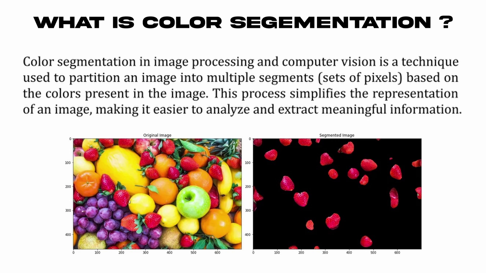

© 𝗗𝗼𝗰𝘂𝗺𝗲𝗻𝘁𝗮𝘁𝗶𝗼𝗻 𝗯𝘆 𝘁𝘃𝗵𝗮𝗿𝗶𝗸𝗿𝗶𝘀𝗵𝗻𝗮

5 𝘮𝘪𝘯𝘶𝘵𝘦 𝘳𝘦𝘢𝘥 📚 
  

<!------ PROJECT TITLE ------>

    

    

<!------ WHAT ------>

    

<h1>🀠Essence of the Project</h1>

The project explores the technique of color segmentation in image processing and computer vision. Color segmentation partitions an image into multiple segments based on the colors present, simplifying the representation of an image for meaningful analysis. This technique is demonstrated with fruits and Rubik's cubes, emphasizing the practical applications of color segmentation in autonomous driving, robotics, and digital media editing.

  

 
     

<!------ WHY ------>

    

<h1>🯠Project Vision</h1>

The vision of this project is to leverage color segmentation to facilitate better understanding and analysis of complex images. By converting images from RGB to HSV color spaces, the project aims to isolate color information effectively and allow the segmentation of intricate patterns. This segmentation simplifies 3D object detection and enhances the precision of machine learning models used in various domains.

 
     

<!------ HOW ------>

    

<h1>🪓Project Implementation</h1>

<h2>💠 Software Design & Tools </h2>

The Color Clustering project employs Python, OpenCV, and other image processing tools to implement segmentation algorithms. It begins by transforming images into HSV color space, then applies various segmentation techniques to detect and isolate different color regions. By fine-tuning OpenCV parameters, the project successfully identifies unique color clusters, leading to improved object identification and clustering results.

 &nbsp;
 &nbsp;
  &nbsp;

  

<!------ Deployment and Testing ------>

<h2>💠 Technical Terms </h2>

<h3>▸ What is Color Segementation? </h3>

    

 

<h3>▸ What is RGB Image?</h3>

An RGB image is a digital image that represents color using the Red-Green-Blue (RGB) color model. In this model, each pixel is assigned a value for red, green, and blue channels, which combine to produce a wide range of colors. This format is widely used in digital photography and displays, as it closely aligns with human perception of colors.

  

    

  

<h3>▸ What is HSV Scale?</h3>

The Hue-Saturation-Value (HSV) color model is used in image processing to represent colors more intuitively. **Hue** defines the color type (e.g., red, blue), **Saturation** measures color intensity, and **Value** indicates brightness. This model separates chromatic content (hue and saturation) from intensity (value), making it suitable for tasks like color segmentation, where isolating hues is critical.

  

    

  

<h3>▸ What is Grayscale Image?</h3>

A grayscale image represents visual data using varying shades of gray, from black to white. Each pixel in a grayscale image contains only intensity information without color. This format is used in image processing tasks like edge detection or texture analysis, where color is less important than the intensity variations.

  

    

  

<!------ Result and Analysis ------>

<h2>💠 Deployment & Testing </h2>

    

    

    

<!------ Result and Analysis ------>

<h2>💠 Results & Analysis </h2>

<table align="center">
  <tr>
    <td align="center">
      
      
Image 1

    </td>
    <td align="center">
      
      
Image 2

    </td>
    <td align="center">
      
      
Image 3

    </td>
  </tr>
  <tr>
    <td align="center">
      
      
Image 4

    </td>
    <td align="center">
      
      
Image 5

    </td>
    <td align="center">
      
      
Image 6

    </td>
  </tr>
</table>

    

<!------ End Image ------>

    

