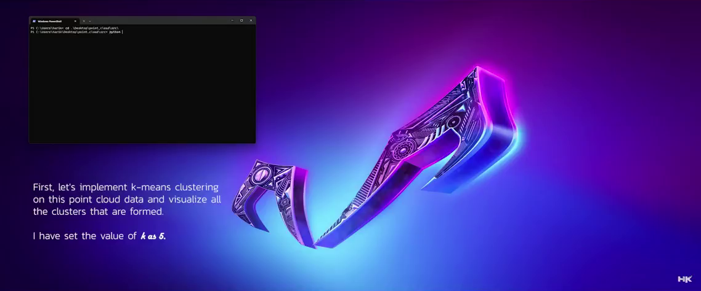

© 𝗗𝗼𝗰𝘂𝗺𝗲𝗻𝘁𝗮𝘁𝗶𝗼𝗻 𝗯𝘆 𝘁𝘃𝗵𝗮𝗿𝗶𝗸𝗿𝗶𝘀𝗵𝗻𝗮

5 𝘮𝘪𝘯𝘶𝘵𝘦 𝘳𝘦𝘢𝘥 📚 
  

<!------ PROJECT TITLE ------>

    

    

<!------ WHAT ------>

    

<h1>🀠Essence of the Project</h1>

This project explores advanced methodologies to optimize point cloud data using K-Means clustering and KD-Tree algorithms, focusing on reducing data complexity while maintaining key information. The technique I apply helps improve the efficiency of data processing and is crucial for applications in 3D modeling, autonomous vehicle navigation, and spatial analysis.

  

 
     

<!------ WHY ------>

    

<h1>🯠Project Vision</h1>

The vision for this project is to set a benchmark in point cloud data optimization, demonstrating how clustering and spatial indexing can drastically enhance data usability. My goal is to provide a streamlined approach that enables real-time analysis and manipulation of large datasets, which are typically challenging due to their size and complexity.

 
     

<!------ HOW ------>

    

<h1>🪓Project Implementation</h1>

<h2>💠 Software Design & Tools </h2>

Utilizing Python and a suite of scientific libraries including Numpy, SciPy, and Pandas, I implement K-Means for initial data clustering followed by KD-Tree for efficient spatial querying. I also employ OpenCV for preliminary data processing and Open3D for visualizing and manipulating the point cloud data. The integration of these tools ensures robust data processing, visualization, and analysis capabilities.

 &nbsp;
 &nbsp;
 &nbsp; 
 &nbsp; 
 &nbsp;
 &nbsp;
 &nbsp;

     

<!------ Technical Terms ------>

<h2>💠 Project Technical Terms & Concept</h2>

<h3>▸ What are point clouds? </h3>

Point clouds are sets of data points in space, most often produced by 3D scanners. These points represent the external surface of an object. As a fundamental component in the field of computer vision and remote sensing, point clouds are used to create 3D models and perform spatial analysis, crucial in numerous applications such as advanced robotics, conservation, architecture, and forensics.

<h3>▸ What is k-means algorithm?</h3>

The k-means algorithm is a popular clustering method used in data analysis and machine learning. It partitions n observations into k clusters in which each observation belongs to the cluster with the nearest mean. This results in a partitioning of the data space into Voronoi cells. K-means is particularly useful for pre-processing data, reducing complexity in large datasets, and identifying strong patterns.

<h3>▸ What is k-d tree algorithm?</h3>

A k-d tree (short for k-dimensional tree) is a space-partitioning data structure for organizing points in a k-dimensional space. k-d trees are useful in several applications, including range searches and nearest neighbor searches. In point cloud processing, k-d trees facilitate efficient querying and indexing, which is critical for the performance improvements in tasks like 3D scene reconstruction.

   

<!------ Deployment and Testing ------>

<h2>💠 Deployment and Testing </h2>

    

  

    

  

    

  

    

  

    

  

    

  

    

  

    

  

    

  

    

  

    

  

<!------ Result and Analysis ------>

<h2>💠 Results & Analysis </h2>

The images below showcase the effectiveness of K-Means clustering and KD-Tree algorithms on point cloud data. The first visualization illustrates the segmentation of downsampled point cloud data into distinct clusters using the K-Means algorithm, which took approximately 0.998 seconds. This rapid clustering demonstrates the algorithm's efficiency in handling large datasets. The second visualization depicts the KD-Tree downsampling, which effectively reduced data complexity and took about 21.68 seconds. These methods significantly optimize the processing time and enhance the visualization of point cloud data, proving essential for accurate and efficient analysis in various applications.

    

  

    

 
     

<!------ End Image ------>

    

