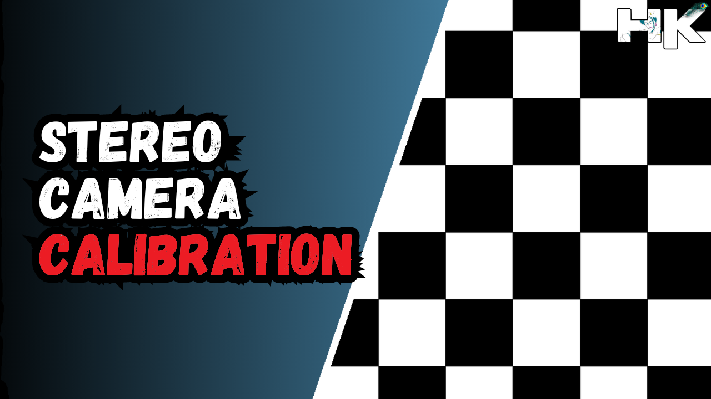
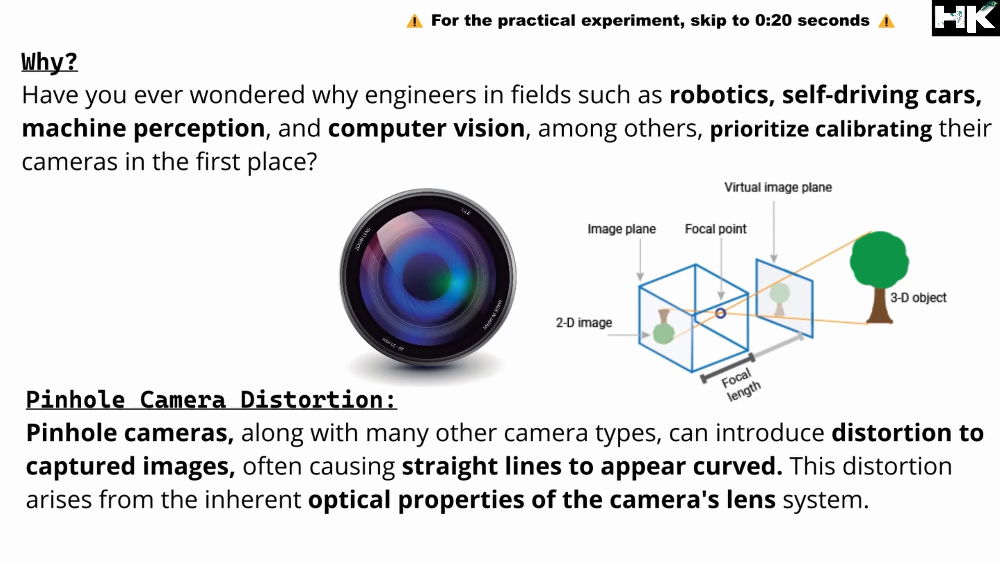
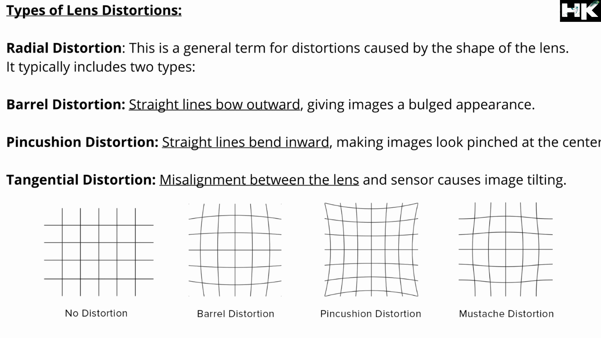
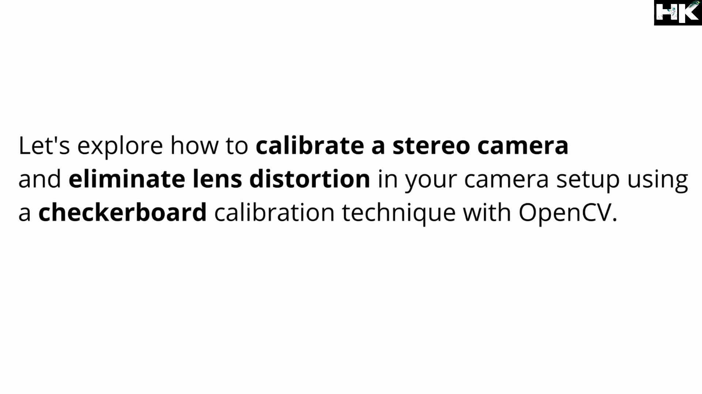

© 𝗗𝗼𝗰𝘂𝗺𝗲𝗻𝘁𝗮𝘁𝗶𝗼𝗻 𝗯𝘆 𝘁𝘃𝗵𝗮𝗿𝗶𝗸𝗿𝗶𝘀𝗵𝗻𝗮

5 𝘮𝘪𝘯𝘶𝘵𝘦 𝘳𝘦𝘢𝘥 📚 
  

<!------ PROJECT TITLE ------>

    

    

<!------ WHAT ------>

    

<h1>🎀 Essence of the Project</h1>

Implementation of the Proximal Policy Optimization (PPO) algorithm for a ball balancing slab in reinforcement learning. This technique optimizes the control policy to maintain the ball's position on the slab, adapting to variations in the environment. The goal is to develop a robust and adaptable system that can effectively balance the ball under dynamic conditions, enhancing stability and response accuracy.

  

 
     

<!------ WHY ------>

    

<h1>🎯 Project Vision</h1>

The project vision for the ball balancing slab using Proximal Policy Optimization (PPO) algorithms in reinforcement learning is to develop advanced control systems that excel in dynamic and unpredictable environments. The aim is to leverage the adaptability and efficiency of PPO algorithms to create a model that balances the ball on the slab with high precision and quickly adjusts to changes, such as external disturbances or varying surface inclinations.

 
     

<!------ HOW ------>

    

<h1>🪓Project Implementation</h1>

<h2>💠 Software Design & Tools </h2>

The PPO Ball Balancing project utilizes Unity and C# for game scripting and Python with the ML-Agents package for backend computations. This integration enables the application of the Proximal Policy Optimization (PPO) algorithm, ensuring efficient learning and performance optimization in real-time simulations.

 &nbsp;
 &nbsp;
 &nbsp;

  

<!------ Deployment and Testing ------>

<h2>💠 Deployment and Testing </h2>

<h3>▸ Project Summary: </h3>
The project is designed to demonstrate a reinforcement learning (RL) scenario where an AI agent is tasked with balancing a ball on a slab. The agent receives a small positive reward incrementally for each time step that the ball stays on the slab, encouraging the agent to learn strategies for maintaining balance. 
Conversely, a negative reward is given when the ball falls off, which helps the agent to learn from its mistakes and avoid actions leading to such an outcome. This control mechanismS allows the slab to be rotated along two axes, which adds complexity to the task and requires the agent to develop a nuanced understanding of the physics involved.   

    

 

<h3>▸ About Proximal Policy Optimization (PPO): </h3>
Proximal Policy Optimization (PPO) is a policy gradient method for reinforcement learning which alternates between sampling data through interaction with the environment and optimizing a "surrogate" objective function using stochastic gradient ascent. Developed by OpenAI, PPO aims to improve upon the stability and sample efficiency of previous methods like Trust Region Policy Optimization (TRPO) but with simpler implementation and better general performance.   

    

 

    

 

<h3>▸ Key aspects:</h3>
• Clipped Objective: Limits policy updates to prevent excessive changes.  
• Multiple Updates: Allows several mini-batch updates per data sample for better efficiency.  
• KL Penalty/Clipping: Ensures policy updates stay within a "safe" range to maintain training stability.  
• Advantage: PPO is favored for its simplicity, efficiency, and consistent performance across various RL tasks.  

<!------ Result and Analysis ------>

<h2>💠 Results & Analysis </h2>

    

The analysis of the PPO Ball Balancing project demonstrates successful ball stabilization on the slab with the ability to rapidly adapt to environmental changes. Quantitative metrics and real-time visualizations confirm the algorithm's efficiency and responsiveness, showcasing the practical viability of the system in dynamic scenarios.

 
     

<!------ End Image ------>

    

