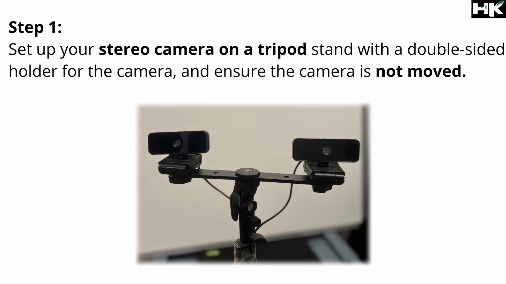

<!------ PROJECT TITLE ------>

    

    

<!------ WHAT ------>

    

 

<h1>🎀 Essence of the Project</h1>

Stereo camera calibration is essential for computer vision tasks where precise depth perception is crucial. This project demonstrates the process of calibrating two cameras to create a stereo vision system that can accurately map the 3D coordinates of objects in its view. By calibrating the cameras, we enhance their ability to estimate depth, improving the performance of applications ranging from autonomous driving to augmented reality.

  

 
     

<!------ WHY ------>

    

<h1>🎯 Project Vision</h1>

Accurate stereo camera calibration is the backbone of any depth-sensing system, crucial for ensuring precise measurements in 3D space. This project aims to illustrate the importance of calibration in enhancing the reliability and accuracy of depth estimates, which are fundamental for the safety and efficiency of technologies reliant on 3D vision, such as robotic navigation systems and interactive simulations.

 
     

<!------ HOW ------>

    

<h1>🪓Project Implementation</h1>

<h2>💠 Software Design & Tools </h2>

This project is implemented using OpenCV, a powerful tool for computer vision applications that includes support for a wide range of image processing operations necessary for camera calibration. Detailed procedures are followed to capture images, detect patterns, and calculate the camera parameters and distortion coefficients that will refine the stereo camera setup.

 

 &nbsp;
 &nbsp;
 &nbsp;

  

<!------ Technical Terms ------>

<h2>💠 Project Technical Terms & Concepts </h2>

<h3>▸ Why do we need to camera calibration?</h3>

Camera calibration is essential to correct lens distortions, ensure accurate measurements in images, and enable precise 3D vision in computer vision applications. It determines the camera's intrinsic and extrinsic parameters, which are crucial for tasks such as 3D reconstruction, robot navigation, and augmented reality, where spatial accuracy is imperative.

  

    

  

<h3>▸ What is pinhole camera model?</h3>

The pinhole camera model is a standard imaging model used in computer vision to describe the mathematical relationship between 3D points in the real world and 2D points in an image. It simplifies the process of projecting points from a scene onto a camera sensor by considering the camera as a pinhole that captures light rays passing through a single point.

  

<h3>▸ What is camera focal length?</h3>

Camera focal length refers to the distance between the camera sensor and the optical center of the lens when the lens is focused on a subject at infinity. It determines the field of view of the camera and influences the magnification level of the captured images, affecting how 'zoomed in' objects appear.

  

<h3>▸ What is optical center of a camera?</h3>

The optical center of a camera, often referred to as the principal point, is the point on the camera sensor where the optical axis meets it. This point is critical in the calibration process as it serves as the reference from which all measurements and adjustments for image alignment and 3D positioning are made.

  

<h3>▸ Types of Distortions?</h3>

In camera systems, there are primarily two types of distortions: radial and tangential. Radial distortion causes straight lines to appear curved and varies with distance from the optical center, while tangential distortion occurs when the lens and the image plane are not parallel, typically resulting in an image that appears to be tilted.

  

    

  

<h3>▸ What is distortion coefficient array (K matrix)?</h3>

The distortion coefficient array, often referred to as the K matrix, encapsulates the intrinsic parameters of a camera, including the focal length, optical center, and distortion coefficients. This matrix is used to convert 3D coordinates into 2D pixel coordinates in an image and is critical for correcting distortions and achieving accurate camera calibration.

  

<!------ Deployment and Testing ------>

<h2>💠 Deployment and Testing </h2>

    

  

    

  

    

  

    

  

<!------ Result and Analysis ------>

<h2>💠 Results & Analysis </h2>

The calibration results clearly identify the camera's focal length, which is evident in the intrinsic matrix, as well as the optical center. Additionally, the primary goal is to determine the extent of distortion in our lens, which can be ascertained from the previously calculated distortion coefficients, both radial and tangential. The intrinsic matrix and distortion coefficients are vital for correcting the stereo images, making the 3D reconstruction tasks more accurate and reliable.

  

    

 
    

<!------ End Image ------>

    

