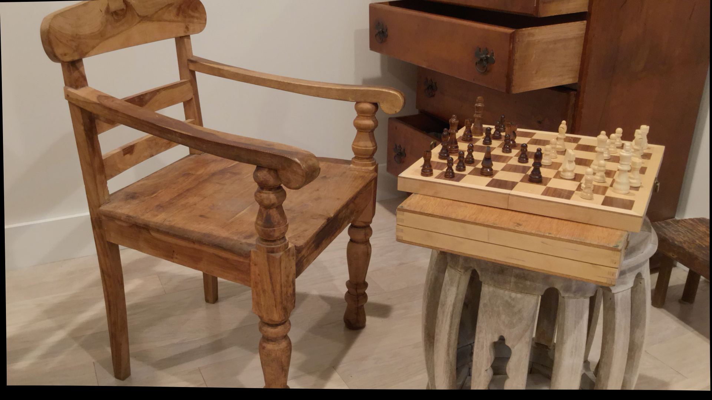
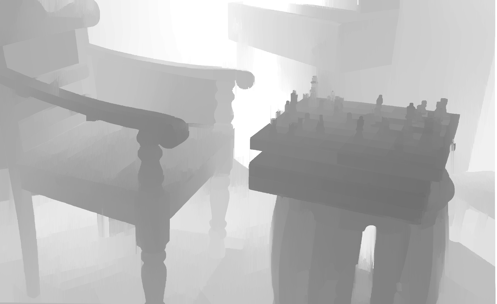
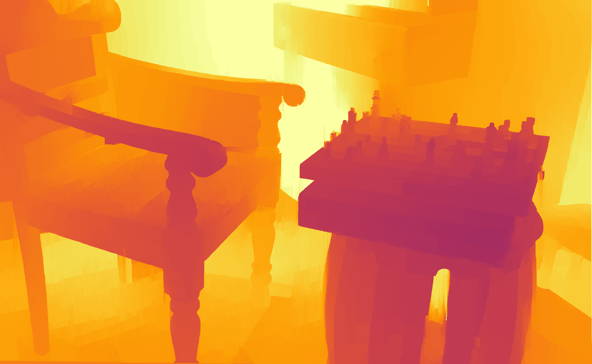

© 𝗗𝗼𝗰𝘂𝗺𝗲𝗻𝘁𝗮𝘁𝗶𝗼𝗻 𝗯𝘆 𝘁𝘃𝗵𝗮𝗿𝗶𝗸𝗿𝗶𝘀𝗵𝗻𝗮

5 𝘮𝘪𝘯𝘶𝘵𝘦 𝘳𝘦𝘢𝘥 📚 
  

<!------ PROJECT TITLE ------>

    

    

<!------ WHAT ------>

    

<h1>🀠Essence of the Project</h1>

The <strong>Stereo Semi-Global Block Matching (StereoSGBM)</strong> algorithm is a method used in computer vision for estimating the depth information from a pair of stereo images. This algorithm is an enhancement over the simpler block matching techniques (such as StereoBM) for stereo correspondence problems. The goal of StereoSGBM and similar algorithms is to reconstruct a 3D scene from two stereo images by finding the disparity (the difference in horizontal position) between corresponding points in the left and right images.

  

    

<!------ WHY ------>

    

<h1 style="text-align: left;">🎯 Project Vision</h1>

The project utilizes the StereoSGBM algorithm to enhance depth estimation, providing a significant improvement over traditional methods. By leveraging its accuracy and computational efficiency, the initiative aims to address challenges in 3D scene reconstruction. This approach facilitates more reliable 3D modeling for applications in autonomous driving, robotics, and immersive experiences.

▸ <code>Accuracy:</code> StereoSGBM offers superior depth perception in complex settings, improving 3D reconstruction accuracy.   
▸ <code>Robustness:</code> It's more resilient against environmental variations, ensuring stable performance across conditions.   
▸ <code>Flexibility:</code> Adjustable parameters allow for tailored optimization, enhancing depth estimation for various applications.   
▸ <code>Comprehensive Coverage:</code> The algorithm effectively handles occlusions and textureless areas, providing a cohesive depth map.   

    

     

<!------ HOW ------>

    

<h1 align="ledt">🪓 Project Implementation</h1>
<h2 style="text-align: left;">💠 Software Design & Tools </h2>

The project is built on OpenCV for Python, utilizing the StereoSGBM algorithm to perform depth estimation from stereo images. This approach allows for the extraction of high-precision depth information, essential for 3D scene reconstruction. The implementation involves preprocessing the images, computing the disparity maps using StereoSGBM, and applying post-processing techniques like WLS filtering to enhance the quality. Python's flexibility and OpenCV's comprehensive library support the efficient development and testing of the depth estimation process.

  <!-- Windows Badge -->
   &nbsp;
  <!-- VS Code Badge -->
   &nbsp;
  <!-- Python Badge -->
   &nbsp;
  <!-- OpenCV Badge -->
  

  

<!------ Deployment------>
<h2 align="left">💠 Deployment</h2>

▸ Initialization of camera parameters, such as focal length and baseline, is crucial for achieving accurate depth estimation, setting the foundation for precise 3D scene reconstruction.  
▸ Configuration of StereoSGBM and WLS filter parameters is tailored to enhance disparity computation, with the WLS filter significantly improving the quality by reducing noise and preserving edge details, thus ensuring a more accurate depth perception.  
▸ Preprocessing involves converting input images to grayscale, enhancing the StereoSGBM algorithm's ability to compute disparities effectively, leading to more reliable depth estimation results.  
▸ Computation of the disparity map using StereoSGBM, followed by refinement with the WLS filter, showcases the algorithm's ability to generate high-quality depth maps. This process benefits from WLS filtering by achieving clearer, more detailed disparity maps, crucial for nuanced depth analysis.  
▸ Depth map extraction and normalization are performed using camera parameters, allowing for the visualization of the scene's 3D structure in a way that highlights depth variations clearly and accurately.  
▸ The option to save and display processed images facilitates the direct examination of the algorithm's output, providing a visual confirmation of the disparity and depth map quality, essential for validating the depth estimation process.

  

<!------ Testing------>
<h2 align="left">💠 Testing</h2>

▸ The testing phase involves running the script on a set of stereo images to evaluate the accuracy of depth estimation across various scenes. This includes examining the quality of the disparity and depth maps for consistency and detail.    
▸ Performance and robustness are assessed by applying the algorithm to images with varying levels of complexity and texture, ensuring that the depth estimation is reliable under different conditions.

  

<h2 align="left">💠 Input Image (data)</h2>
<table align="center">
  <tr>
    <td align="center">
       
      
    </td>
    <td align="center">
       
      
    </td>
  </tr>
</table>  

<h2 align="left">💠 Output Image (generated_images)</h2>
<table align="center">
  <tr>
    <td align="center">
       
      
    </td>
    <td align="center">
       
      
    </td>
  </tr>
  <tr>
    <td align="center" colspan="2">
       
      
    </td>
  </tr>
</table>  

<!------ HOW TO USE MY CODE ------>
<h2 align="left">💠 How to use my code?</h2>

The provided Python script leverages the StereoSGBM algorithm for advanced, sophisticated depth estimation from stereo images. To effectively utilize this powerful code and explore its full potential, follow these outlined steps carefully.

<ol>
  <li>Ensure OpenCV and NumPy are installed in your Python environment for image processing and numerical operations.</li>
  <li>Clone the repository to access the Python script.</li>
  <li>Navigate to and open <code>SGBM_Stereo_DepthEstimation.py</code> in your preferred code editor.</li>
  <li>Configure <code>Left_Image_Path</code> and <code>Right_Image_Path</code> within the script to point to your specific stereo image pair.</li>
  <li>Adjust StereoSGBM and WLS filter parameters as needed to optimize disparity map quality for your images.</li>
  <li>Execute the script to generate and optionally save or display the disparity map and depth map, exploring the 3D structure of the scene.</li>
</ol>

This procedure enables you to harness the script for precise 3D scene reconstruction using stereo image pairs, showcasing the depth estimation capabilities of the StereoSGBM algorithm enhanced by WLS filtering.

<!------ END ------>

    

