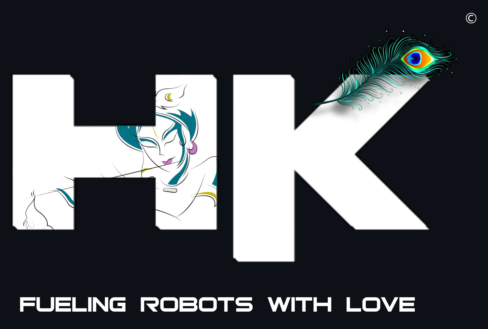

**Copyright © 2024 Venkata Harikrishna, Talapala**  
**Copyright © 2024 tvharikrishna**

  

**All Rights Reserved.**

---

<table border="0">
  <tr>
    <td valign="top">
      <strong>Copyright &copy; 2024 Venkata Harikrishna, Talapala</strong> 
      <strong>Copyright &copy; 2024 tvharikrishna</strong> 
      <strong>All Rights Reserved.</strong>
    </td>
    <td align="right">
      
    </td>
  </tr>
</table>

**Permissions**:
- ✅ Only source code is licensed under **GNU GPL v3.0**; use, modify, and share according to its terms.

**Limitations**:
- ❌ No commercial use of documentation, non-code elements, or documentation footer images.
- ❌ No copying or redistribution of images, assets, the HK Logo, or any other material.
- ❌ No creation of derivative works from non-code elements, including documentation.
- ❌ No use of trademarks, specifically the HK Logo.
- ❌ No liability or warranty is provided for any elements.

 

<table>
  <tr>
    <th>📝</th>
    <th>Category</th>
    <th width="135px">License</th>
    <th>Limitations</th>
  </tr>
  <tr>
    <td>✅</td>
    <td><strong>Code</strong></td>
    <td>GNU-GPL v3.0</td>
    <td>Use, modify, and share as per its terms.</td>
  </tr>
  <tr>
    <td>❌</td>
    <td><strong>Assets</strong></td>
    <td>Copyrighted ©</td>
    <td> All non-code components, including documentation, associated imagery, footer graphics, visual assets, and miscellaneous files, are the exclusive safeguarded by copyright statutes.</td>
  </tr>
  <tr>
    <td>❌</td>
    <td><strong>HK Logo</strong></td>
    <td>Copyrighted ©</td>
    <td>Protected by the Department for Promotion of Industry and Internal Trade under the Government of India's Intellectual Property Rights. Legal action for infringement on all social media platforms.</td>
  </tr>
</table>
