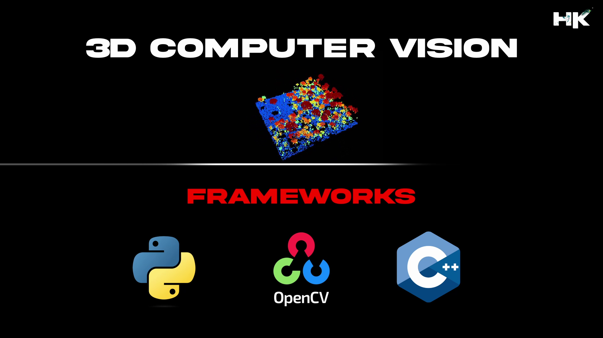

    

  

    

# 🔻Repository Details

This repository meticulously documents my extensive journey through various projects related to Computer Vision, showcasing a deep dive into the mechanics and applications of modern visual perception technologies. As stated below, my projects relate to the following topics.
 

# 🔻What is Computer Vision

Computer Vision is a domain within computer science that empowers computers and systems to extract significant information from digital images, videos, and other visual inputs and to take action based on that information. It emulates human vision by recognizing patterns, objects etc.

# 🔻State-of-the-Art (SOTA) Computer Vision Techniques
<!-- Stereo Vision Overview -->

<table>
<tr>
    <th>Stereo Vision</th>
    <th>Depth Estimation</th>
    <th>Visual Odometry</th>
    <th>Augmented Reality</th>
</tr>
<tr>
    <td>3D Reconstruction</td>
    <td>3D Flow Scene</td>
    <td>Structure from Motion</td>
    <td>3D SLAM</td>
</tr>
<tr>
    <td>Vision Segmentation</td>
    <td>Pose Estimation</td>
    <td>3D Scene Understanding</td>
    <td>Visual SLAM</td>
</tr>
<tr>
    <td>Optical Flow Estimation</td>
    <td>Multi-View Stereo</td>
    <td>Stereo Camera Calibration</td>
    <td>Point Clouds</td>
</tr>
</table>

 
     

    

